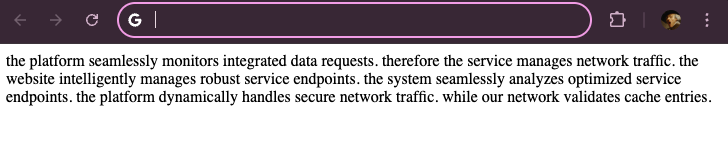

# RoboNope-nginx: enforce robots.txt rules

[](LICENSE)
[](https://nginx.org/)
[](https://github.com/raminf/RoboNope-nginx/releases)
[](https://en.wikipedia.org/wiki/C_(programming_language))
[](https://github.com/raminf/RoboNope-nginx/commits/main)


`RoboNope-nginx` is a module designed to deny access to files disallowed in the robots.txt file. It can also serve as a [honeypot](https://en.wikipedia.org/wiki/Honeypot_(computing)), randomly serving generated content to bots that ignore [robots.txt](https://developers.google.com/search/docs/crawling-indexing/robots/intro) rules. 

_Ignore at your peril!_

## Problem

[Web crawling](https://en.wikipedia.org/wiki/Web_crawler) goes back to the early days of the web. In the spirit of cooperation, search engines were supposed to abide by the wishes of a website's owner by looking for, and honoring the contents of a `robots.txt` file (if present).

However, this was made voluntary. There have been [many reports of crawlers ignoring the wishes of content owners](https://mjtsai.com/blog/2024/06/24/ai-companies-ignoring-robots-txt/).

The technology makes this easy. For example, in [Mechanize](https://github.com/sparklemotion/mechanize), a popular web-scraping library, it is simple to bypass a `robots.txt` file:

```
from mechanize import Browser
br = Browser()
br.set_handle_robots(False) # Ignore robots.txt
```
And in [Scrapy](https://scrapy.org), it's a matter of setting `ROBOTSTXT_OBEY` to `False`.

## What can you do?

There are a number of steps content-providers can take to limit access to their content:

- Define a `robots.txt` file.
- Add meta tags to each page: `<meta name="robots" content="noindex,nofollow">`.
- Add `nofollow` attributed to links: `<a href="http://destination.com/" rel="nofollow">link text</a>` 
- Make every link go through a javascript filter to check access.
- Set up password access through `.htaccess`

The first three are voluntary and can be ignored, and the last two are a pain to set up and maintain.

Why not just enforce `robots.txt` and make it __mandatory__ instead of __optional__?

This is what `RoboNope` does.

## Example

Let's assume your `robots.txt` file looks like this:

```
User-agent: *
Allow: /
Disallow: /norobots/
Disallow: /private/
Disallow: /admin/
Disallow: /secret-data/
Disallow: /internal/

User-agent: BadBot
Disallow: /

User-agent: Googlebot
Disallow: /nogoogle/
Disallow: /private/google/
Disallow: /*.pdf$
```
This means all content is allowed, except for paths that match the URLs in the disallowed list. Next, it specifies that a crawler that identifies itself as `BadBot` is completely disallowed. Finally, the official Googlebot is told not to search for specific file patterns.

Obviously, a misbehaving bot can ignore any and all these directives, or present itself as a benign crawler via faking its `User-agent` setting.

With `RoboNope-nginx`, if someone tries to access any page that matches the _Disallow_ tags, they get:

```
% curl https://{url}/private/index.html
<html>
  <head>
    <style>
      .RRsNdyetNRjW { opacity: 0; position: absolute; top: -9999px; }
    </style>
  </head>
  <body>
    <div class="content">
      the platform seamlessly monitors integrated data requests. therefore the service manages network traffic. the website intelligently manages robust service endpoints. the system seamlessly analyzes optimized service endpoints. the platform dynamically handles secure network traffic. while our network validates cache entries.
    </div>
    <a href="/norobots/index.html" class="RRsNdyetNRjW">Important Information</a>
  </body>
</html>
```

To humans, this looks like this:



But to a mis-behaving crawler, it offers a tantalizing link to follow (notice the link is invisible to humans): 

```
<a href="/norobots/index.html" class="RRsNdyetNRjW">Important Information</a>
```

Following that link, the crawler may receive a different file:

```
<html>
  <head>
    <style>
      .RRsNdyetNRjW { opacity: 0; position: absolute; top: -9999px; }
    </style>
  </head>
  <body>
    <div class="content">
      the platform seamlessly monitors integrated data requests. therefore the service manages network traffic. the website intelligently manages robust service endpoints. the system seamlessly analyzes optimized service endpoints. the platform dynamically handles secure network traffic. while our network validates cache entries.
    </div>
    <a href="/admin/secrets.html" class="RRsNdyetNRjW">Important Information</a>
  </body>
</html>
```

This has randomly generated gibberish content, and a link to a different page (randomly selected from whatever has been explicitly disallowed inside `robots.txt`):

```
<a href="/admin/secrets.html" class="RRsNdyetNRjW">Important Information</a>
```

And so on and so forth...

You can, of course, start the chain by explicitly including a link into your home page that goes to a disallowed link. Crawlers recursively following down all links will inevitably fall into the [honeypot](https://en.wikipedia.org/wiki/Honeypot_(computing)) trap and get stuck there.

## Honeypot Link Configuration

The downside to this endless cat and mouse game is that your web-server may get hammered by a mis-behaving crawler, generating an endless series of links. As satisfying as this might be, _you_ are paying for all this processing time and traffic.

An alternative is to configure the module to direct crawlers to a single educational resource, instead of an endless loop, by setting the `robonope_instructions_url` directive in your `nginx.conf` file. For example, the following will link to [Google's page on robots.txt]((https://developers.google.com/search/docs/crawling-indexing/robots/intro)) introducing developers to good crawling etiquette:

```
robonope_instructions_url "https://developers.google.com/search/docs/crawling-indexing/robots/intro";
```

The generated hidden link for the page returned will be:

```
<a href="https://developers.google.com/search/docs/crawling-indexing/robots/intro" class="wgUxnAjBuYDQ">Important Information</a>
```
The content will still be randomly generated text, but the link will send the crawler off to learn how to behave properly.

## Logging

The system can maintain a log of mis-behaving requests in a local database (default is `SQLite` but also work-in-progress to use `DuckDB`).

To enable logging, simply set the `robonope_db_path` directive in your configuration:

```
robonope_db_path /path/to/robonope.db;
```

When the database path is not set, logging is disabled.

You can run the [sqlite3 CLI](https://sqlite.org/cli.html) to see what it stores:

```
sqlite3 demo/robonope.db .tables

1|2025-03-16 18:10:55|127.0.0.1|curl/8.6.0|/private/index.html HTTP/1.1
Host|/private/
2|2025-03-16 18:17:17|127.0.0.1|curl/7.86.0|/norobots/index.html HTTP/1.1
Host|/norobots/
...
```

## Why nginx?

According to [W3Techs](https://w3techs.com/technologies/overview/web_server) the top 5 most popular webservers as of March 2025 are:

- [nginx](https://nginx.org) (33.8%)
- [Apache](https://httpd.apache.org) (26.8%)
- [Cloudflare Server](https://www.cloudflare.com) (23.2%)
- [Litespeed](https://www.litespeedtech.com/products/litespeed-web-server) (14.5%)
- [Node.js](https://nodejs.org) (4.2%)

This first version has been tested with `nginx` v1.24. If there is demand, separate versions for other servers with the same functionality will be released. This includes [Wordpress robots.txt](https://docs.wpvip.com/security-controls/robots-txt/).

And of course, community contributions are most Welcome!

## Features

- Parses and enforces `robots.txt` rules
- Generates _dynamic_ content for disallowed paths
- Tracks bot requests in SQLite (or DuckDB -- _work in progress_) when database path is configured
- Supports both static and dynamic content generation
- Configurable caching for performance
- Honeypot link generation with configurable destination via `robonope_instructions_url`
- Test suite
- Cross-platform support

## Quick Start

### Prerequisites

- Nginx (1.24.0 or later recommended)
- PCRE library
- OpenSSL
- [SQLite3](https://sqlite.org/) or [DuckDB](https://duckdb.org) (under development)
- C compiler (gcc/clang)
- make

### Building from Source

```bash
# Clone the repository
git clone --recursive https://github.com/raminf/RoboNope-nginx.git
cd RoboNope-nginx

# Build the module
make
```

This builds the full version of RoboNope, alongside a full copy of Nginx. You can use this to test locally and verify that it does what you want.

When ready, you can build a standalone module that you can install for your existing server, by definining the STANDALONE environment variable before building:

```
% STANDALONE=1 make
```

### Running the Demo

```bash
# Start the demo server (runs on port 8080)
make demo-start

# Test with a disallowed URL
curl http://localhost:8080/private/index.html

or 

make demo-test

# View logged requests (if database logging is enabled)
make demo-logs

# Stop the demo server
make demo-stop
```


### Demo Configuration Options

You can customize the demo environment using these variables:

```bash
# Enable database logging with custom location
DB_PATH=/tmp/robonope.db make demo-start

# Use DuckDB instead of SQLite (work in progress)
DB_ENGINE=duckdb make all demo-start

# Customize the instructions URL for honeypot links
INSTRUCTIONS_URL=https://your-custom-url.com make demo-start
```

### Configuration in nginx.conf

Add to your main nginx.conf:

```nginx
load_module modules/ngx_http_robonope_module.so;

http {
    # RoboNope configuration
    robonope_enable on;
    robonope_robots_path /path/to/robots.txt;
    
    # Optional: Enable database logging
    # robonope_db_path /path/to/database;
    
    # Optional: Set instructions URL for honeypot links
    # robonope_instructions_url "https://your-custom-url.com";
    
    # Optional rate limiting for disallowed paths
    limit_req_zone $binary_remote_addr zone=robonope_limit:10m rate=1r/s;
    
    server {
        # Apply rate limiting to disallowed paths
        location ~ ^/(norobots|private|admin|secret-data|internal)/ {
            limit_req zone=robonope_limit burst=5 nodelay;
            robonope_enable on;
        }
    }
}
```

## License

This project is licensed under the MIT License - see the [LICENSE](LICENSE) file for details. 

## Disclosure

Most of the project, the README, and the artwork was assisted by AI. Even the name was workshopped with an AI. 


